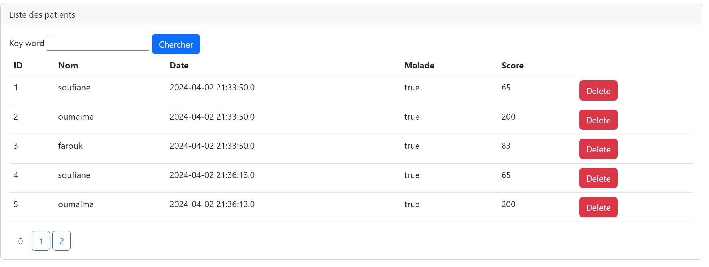

<h3>Compte Rendu Tp3</h3>

Spring MVC Architecture 

1-Afficher les patients: 
Entity Patient:

Patient Repository:

Patient Controller:

Application:

Affichage des patients dans une template Thymeleaf:

2-Faire la pagination:
Affichage:
Ajouter 'size' et 'page' dans le Controlleur

la barre de pagination dans html

3-Chercher les patients:
Ajouter le formulaire de recherche

Ajouter la methode "findByNomContains" dans Patient Repository

Ajouter le mot keyword dans la barre de pagination

Ajouter le parametre keyword dans Patient Controller

Resultat:

4-Supprimer un patient:
Ajouter un boutton delete dans "patients.html" avec une confirmation Onclick

Creer la methode delete dans le controller et faire une redirection vers index

Resultat:

